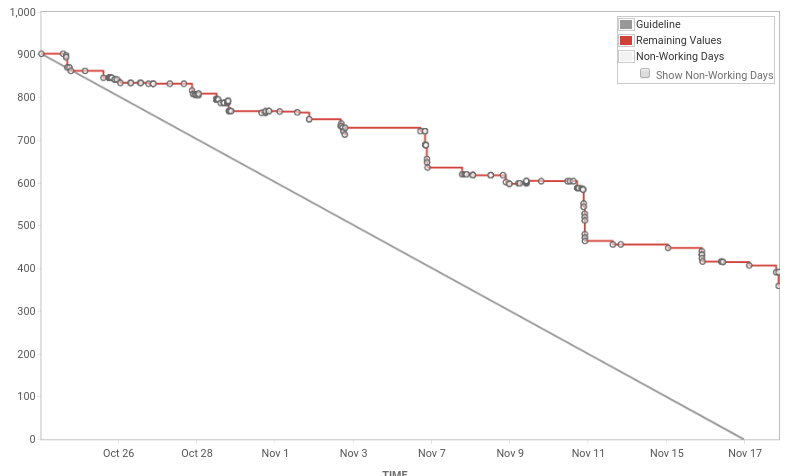

###### PUBGURU PRODUCT DEMO
###### AN END OF SPRINT RITUAL  

###### Sprint 37 (4 weeks)
###### MonetizeMore.com
---
### SPRINT CONCLUSION
- In total we work with 902 story points
- 102 issues were done |
- 30 issues were incomplete (292 story points) |
- * CR = 3 tickets, 88 story points |
- * QA = 7 tickets, 108 story points  |
- * DEV = 5 tickets, 96 |
- In last sprint we left with 12 issues (146 story points) |
---

---
### FEATURES WRAP UP
In this sprint, we introduce a *new beast* to our workflow pipeline: we automate fetcher issues to be JIRA task automatically, instead of just dumping it to Sentry.
While this is awesome in term of we can handled fetchers bugs promptly (previously we need to manually check email/sentry, which we do this occasionally), 
but this affect our strength in closing story points, as bugs are not counted as story points.
---
In the next sprint, we will try managing this better, so that we are not solely treating fetchers bug as *bug*, but some of them should be converted to story points task, 
and may also introducing prioritization of fetchers bug handling, in term of biggest publisher revenue/premium pubs. 
---
All and all, these are the features that has been implemented in this sprint:
---
- DFP Wizard improvements |
- Notifications improvements: filtering notifications based on user related pubs  |
- Pubguru Session/pageview columns in pubguru total/discrepancy reports |
---
### THAT'S ALL FOLKS!
- We still have lots of room for improvements for the next sprints! |