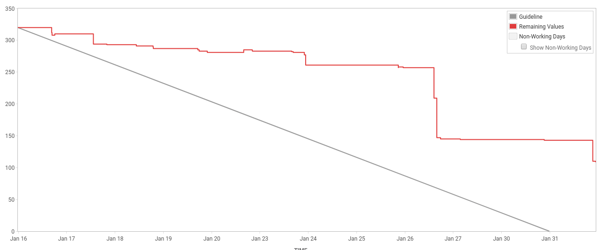

###### PUBGURU PRODUCT DEMO
###### AN END OF SPRINT RITUAL  

###### Sprint 39, Sprint 40 (@ 2 weeks)
###### MonetizeMore.com
---
### SPRINT CONCLUSION
- In Sprint 40 we work with 292 story points
- We have been completing 184 story points |
- 8 issues were incomplete (107 story points) |
- * QA = 5 ticket|
- * DEV = 4 ticket|
---

---
### FEATURES WRAP UP
We keep streamlining our Sentry to Jira automation, and the result getting better. Less duplication, 
so the Jira backlog is more easy to maintain.

---
Major features done in this sprint consisting of Adding Manual Network Params Editor for DFP. This way, 
adops will be able to add new params themselves. 
---
Another major features that eventually not getting deployed to production as it need more UI/UX expert, 
is Creating Per-Publisher Mapping UI for PubGuru Ad Networks to DFP Line Items.

Site filtering added for GumGum fetcher, and the usual fetcher bug fixes        
---
### THAT'S ALL FOLKS!
- * Last but not least, we try to maintain these routines now: |
- * Daily jira story prioritization |
- * Regression test every Monday |
- * Production deployment every Tuesday |
- * Faster and more responsive Code Review |
- * But still, more room for improvement for the next sprint! |