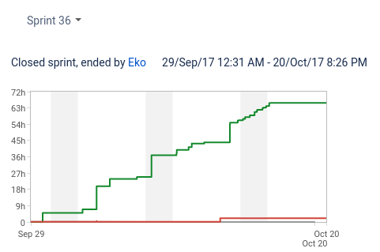
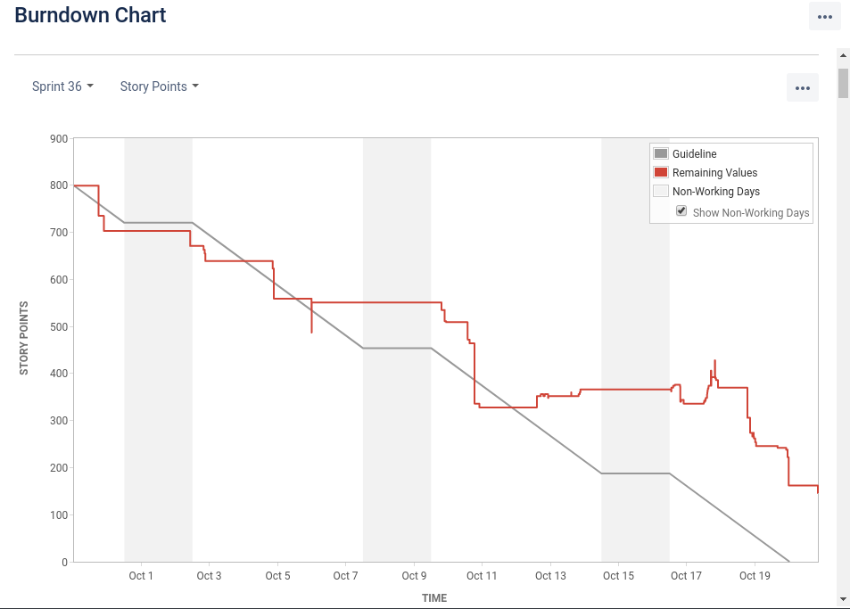

###### PUBGURU PRODUCT DEMO
###### AN END OF SPRINT RITUAL  

###### Sprint 36 (3 weeks)
###### MonetizeMore.com
---
### SPRINT CONCLUSION
- 104 issues were done |
- 12 issues were incomplete (146 story points): |
- * CR 74 |
- * QA 24 |
- * OH 8 |
- * DEV 56 |
- So it's actually we left over with only 64 story point |
- And the remaining 98 story points is in last cleanup process | 

---

---

---
### NOTABLE EVENT: 9 October 2017. Google demo
Stuff that we are focus on:
- Notifications improvements |
- DFP UI Wizard |
---
### 1. Notifications Improvement
- We have somekind of a hard time trying to figure out what this task really is |
- Need several attempt to make right, but after issuing a survey to adops, we found lots of great ideas to implements|
- Some are implemented here, some aren't (to be discuss in the next sprint) |
- Thanks to all devs that contribute to these tasks: Ruzlans, Jino and Anton! |
- DEMO |
---
### 2. DFP UI WIZARD 
- For Adunits creation, we now have a DFP UI Wizard for this. Thanks Mikhail! |
---
### OTHER IMPROVEMENTS
- This is the initial sprint when we try to use staging stream for weekly deployment to prod |
- Master credential is now in DFP credentials page. Thanks Anton! |
- Site filtering in fetchers are improved (we have lots of them! Thanks Jino!)and we have around 30 tasks again for this |
- Currency is now using better algorithm. Thanks Vital! |
---
- We now already use a 3rd party service to decode captcha. For now it's being used in AWS fetcher |
- Lots of fetchers fixes |
---
### THAT'S ALL
- Improvement for next sprint, will be to evaluate our strength (in term of story points in this sprint), and try to calculate better estimates |
- We kinda misses the pair programming session. This probably need to be done in the first week of the sprint |
- Overall, we still have lots of area to improve for the next sprints! |
- Thanks folks!|