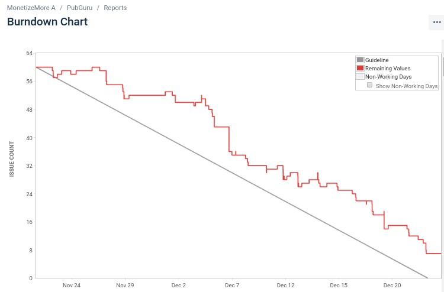

###### PUBGURU PRODUCT DEMO
###### AN END OF SPRINT RITUAL  

###### Sprint 38 (4 weeks)
###### MonetizeMore.com
---
### SPRINT CONCLUSION
- In total we work with 554 story points
- 69 issues were done |
- 8 issues were incomplete (107 story points) |
- * ON HOLD = 1 ticket, 32 story points | 
- * CR = 2 ticket, 32 story points |
- * QA = 4 ticket, 56 story points  |
- * DEV = 1 ticket, bug |
- In last sprint we left with 30 issues (292 story points) |
---

---
### FEATURES WRAP UP
Good news for fetcher bug handling: it seems like as if we handle fetcher bugs more aggresively last sprint, 
now in this sprint. We only encounter smaller number of them. Only 4 of them, while last sprint we handle around 20 of them. 
---
For fetcher bug handling, we are developing a fetcher prioritization index, so that we can handle fetcher bug in a better way,
by designating fetcher importancy.    
---
All and all, these are the major features that has been implemented in this sprint:
---
- Migrating Configurator from tools into pubguru per publisher |
- Notifications improvements: filtering notifications based on user related pubs and we already have notification template for adops to use  |
- As usual, lots of backend/server improvements |
---
### THAT'S ALL FOLKS!
- As usual, we still have lots of room for improvement.|
- Mainly the way we do Code Review,as that phase is the longest to take and may block our speed of acquiring story points for the current sprint. 
Probably, as suggessted by Anton, we should make Friday as the official day of Code Review-ing.  |
- Also, now we are deploying new features to production every early Monday |