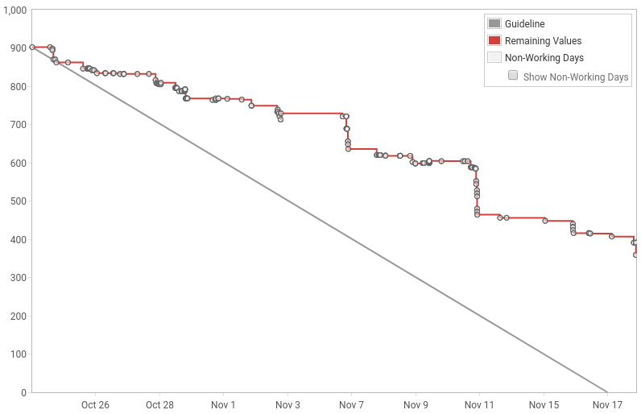

###### PUBGURU PRODUCT DEMO
###### AN END OF SPRINT RITUAL  

###### Sprint 37 (4 weeks)
###### MonetizeMore.com
---
### SPRINT CONCLUSION
- In total we work with 902 story points
- 102 issues were done |
- 30 issues were incomplete (292 story points) |
- * CR = 3 tickets, 88 story points |
- * QA = 7 tickets, 108 story points  |
- * DEV = 5 tickets, 96 |
- In last sprint we left with 12 issues (146 story points) |

---

---
Burnchart
---
### FEATURES WRAP UP
We work on these features
DAY 1

- Notifications improvements |
- DFP Wizard
- Sentry - jira automation (1713)
- [ASK MIKHAIL] Add option to add invited user to existing pub, instead creating new one (1631)
- add ability to attach a Publisher (1641)
- Store m2hb versions in S3 (1547)
- Fix cookie error in sentry (1615)
---
### 1. Notifications Improvement
- 
---
### THAT'S ALL FOLKS!
- Summary and improvement for next sprint